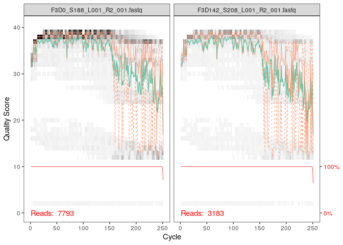

Dada2 tutorial
================

  - [visualitaion des modèles d’erreur du
    foward](#visualitaion-des-modèles-derreur-du-foward)
  - [Aligner les R1 et R2 en contigs](#aligner-les-r1-et-r2-en-contigs)
      - [Calculer le ration](#calculer-le-ration)
  - [résultat des filtre de qualité](#résultat-des-filtre-de-qualité)

\#Package dada2 On appele le packages Dada2 :

``` r
library("dada2")
```

    ## Loading required package: Rcpp

\#DeZipper Les données ont été télécharger avec les commandes dans le
Rmd “001\_data-import”. On défini la variable Path pour changer
d’endroit dans l’arborescence du fichier dézipper MiSeq\_SOP :

``` r
path <- "~/MiSeq_SOP" # CHANGE ME to the directory containing the fastq files after unzipping.
list.files(path)
```

    ##  [1] "F3D0_S188_L001_R1_001.fastq"   "F3D0_S188_L001_R2_001.fastq"  
    ##  [3] "F3D1_S189_L001_R1_001.fastq"   "F3D1_S189_L001_R2_001.fastq"  
    ##  [5] "F3D141_S207_L001_R1_001.fastq" "F3D141_S207_L001_R2_001.fastq"
    ##  [7] "F3D142_S208_L001_R1_001.fastq" "F3D142_S208_L001_R2_001.fastq"
    ##  [9] "F3D143_S209_L001_R1_001.fastq" "F3D143_S209_L001_R2_001.fastq"
    ## [11] "F3D144_S210_L001_R1_001.fastq" "F3D144_S210_L001_R2_001.fastq"
    ## [13] "F3D145_S211_L001_R1_001.fastq" "F3D145_S211_L001_R2_001.fastq"
    ## [15] "F3D146_S212_L001_R1_001.fastq" "F3D146_S212_L001_R2_001.fastq"
    ## [17] "F3D147_S213_L001_R1_001.fastq" "F3D147_S213_L001_R2_001.fastq"
    ## [19] "F3D148_S214_L001_R1_001.fastq" "F3D148_S214_L001_R2_001.fastq"
    ## [21] "F3D149_S215_L001_R1_001.fastq" "F3D149_S215_L001_R2_001.fastq"
    ## [23] "F3D150_S216_L001_R1_001.fastq" "F3D150_S216_L001_R2_001.fastq"
    ## [25] "F3D2_S190_L001_R1_001.fastq"   "F3D2_S190_L001_R2_001.fastq"  
    ## [27] "F3D3_S191_L001_R1_001.fastq"   "F3D3_S191_L001_R2_001.fastq"  
    ## [29] "F3D5_S193_L001_R1_001.fastq"   "F3D5_S193_L001_R2_001.fastq"  
    ## [31] "F3D6_S194_L001_R1_001.fastq"   "F3D6_S194_L001_R2_001.fastq"  
    ## [33] "F3D7_S195_L001_R1_001.fastq"   "F3D7_S195_L001_R2_001.fastq"  
    ## [35] "F3D8_S196_L001_R1_001.fastq"   "F3D8_S196_L001_R2_001.fastq"  
    ## [37] "F3D9_S197_L001_R1_001.fastq"   "F3D9_S197_L001_R2_001.fastq"  
    ## [39] "filtered"                      "HMP_MOCK.v35.fasta"           
    ## [41] "Mock_S280_L001_R1_001.fastq"   "Mock_S280_L001_R2_001.fastq"  
    ## [43] "mouse.dpw.metadata"            "mouse.time.design"            
    ## [45] "stability.batch"               "stability.files"

On aperçoit les noms des fichiers fatsq

\#Obtenir des listes des fastq avant et arrière des reads On crée des
variables : -FnFs : les fichiers fastq R1, c’est-à-dire du read avant
-FnRs : les fichiers fastq R2, c’est-à-dire du read arrière
-sample.names : extrait les noms des échantillons, en supposant que les
noms de fichiers ont un format : NOM DE L’ÉCHANTILLON\_XXX.fastq

``` r
# Forward and reverse fastq filenames have format: SAMPLENAME_R1_001.fastq and SAMPLENAME_R2_001.fastq
fnFs <- sort(list.files(path, pattern="_R1_001.fastq", full.names = TRUE))
fnRs <- sort(list.files(path, pattern="_R2_001.fastq", full.names = TRUE))
# Extract sample names, assuming filenames have format: SAMPLENAME_XXX.fastq
sample.names <- sapply(strsplit(basename(fnFs), "_"), `[`, 1)
```

\#Inspecter les profils de qualité de lecture Pour le moment, nous avons
juste les reads issu d’illumina classé dans deux variables (fnFS : avec
les read avants et fnFR: avec les reads arrière). Nous devons évaluer la
qualité des reads Q30,Q20 pour ensuite retirer les une partie du reads
qui ont un score de qualité mauvais.

On visualise les profils de qualité des read en avant du le premier et
du deuxième read issus de la variable crée précédemment FnFs.

``` r
plotQualityProfile(fnFs[1:2])
```

<!-- -->
Analyse du plot : Il est affiché le premier et le deuxième read des
données fnFS . Il est représenté une carte thermique de la fréquence de
chaque score de qualité pour chaque base. - la ligne verte : un score de
qualité moyen à chaque position - les lignes orange : les quartiles de
la distribution des scores de qualité -La ligne rouge : la proportion de
lectures à l’échelle qui s’étend au moins jusqu’à cette position Ici
comme on travaille avec des read issu d’Illumina ils sont tous de la
même longueur d’ou la ligne plate. Mais il est possible qu’avec
d’autres séquenceurs d’avoir des différences de longueur

\-Les reads avant sont de bonne qualité -conseillé de couper les
derniers nucléotides pour éviter les erreurs moins bien contrôlées qui
peuvent s’y produire : tronquer les read avant à la position 240 (en
coupant les 10 derniers nucléotides).

Nous visualisons donc les profils de qualité des reads en arrière (FnRs)
de la première séquence, de la deuxième, de la troisième et de la
quatrième reads issus de la variable crée précédemment FnRs. On peut
changer le nombre de profil à voir en changeant les chiffres entre
crochet

``` r
plotQualityProfile(fnRs[1:4])
```

<!-- -->

Les reads inverse : bien moins bonne qualité, surtout à la fin
(classique avec Illumina) : 160 le scores de qualité baisse. Mais Dada2
intègre des informations de qualité dans son modèle d’erreur, ce qui
rend l’algorithme robuste aux séquences de moindre qualité. -\> Possible
ajustement

Ici, nous visualisons donc les profils de qualité des reads en arrière
(FnRs) de la première séquence et la quatrième reads

``` r
plotQualityProfile(fnRs[c(1,4)])
```

<!-- -->
\#Filtrer et découper

On attribue les noms de fichiers pour les fichiers fastq.gz filtrés. On
crée les variables : -FiltFs : Place les fichiers filtrés avant -filtRs
: Place les fichers filtré arrière -names filtFs : place les noms des
fichiers filtré des reads avant avec leurs noms associés -names FiltRs :
place les noms des fichiers filtré des reads arrière avec leurs noms
associés

``` r
# Place filtered files in filtered/ subdirectory
filtFs <- file.path(path, "filtered", paste0(sample.names, "_F_filt.fastq.gz"))
filtRs <- file.path(path, "filtered", paste0(sample.names, "_R_filt.fastq.gz"))
names(filtFs) <- sample.names
names(filtRs) <- sample.names
```

Les paramètres de filtrage et découpage standard : -maxN=0 (DADA2 ne
nécessite pas de Ns), -truncQ=2 : on va tronquer pour les reads avant a
240 et 160 pour les reads arrières -rm.phix=TRUE -maxEE=2 -\> le nombre
maximum d’“erreurs attendues” autorisées dans une lecture, ce qui est un
meilleur filtre que la simple moyenne des scores de qualité.

``` r
out <- filterAndTrim(fnFs, filtFs, fnRs, filtRs, truncLen=c(240,160),
              maxN=0, maxEE=c(2,2), truncQ=2, rm.phix=TRUE,
              compress=TRUE, multithread=TRUE) # On Windows set multithread=FALSE
head(out)
```

    ##                               reads.in reads.out
    ## F3D0_S188_L001_R1_001.fastq       7793      7113
    ## F3D1_S189_L001_R1_001.fastq       5869      5299
    ## F3D141_S207_L001_R1_001.fastq     5958      5463
    ## F3D142_S208_L001_R1_001.fastq     3183      2914
    ## F3D143_S209_L001_R1_001.fastq     3178      2941
    ## F3D144_S210_L001_R1_001.fastq     4827      4312

On obtient le nombre de nucléotide qui sont des le départ (reads in ) et
apres filtrage et découpe ( read.out). Pour le reads F3D30 S188 R1 001
:7793 et apres filtration on obtient : 7113 . Il y a donc 680
nucléotides qui ont été enlevers

\#apprentissage des erreurs :

Il est possible d’avoir des erreurs, avec Dada2, on va inspecter les
séquences et voir les erreurs. On utilise un modèle d’erreur
paramétrique err pour les reads avant et arrière.

But : le modèle d’erreur de DADA2 permet identifier les positon avec
forte probabilité d’erreur et donc par la suite changer avec la base la
plus probable, qui ressemble donc plus à la séquence majoritaire proche
abondande.

On crée les variables : -errF : reçoit le modèle d’erreur paramétrique
par la méthode LearnErrors pour les read avant filtré (tronqué)

``` r
errF <- learnErrors(filtFs, multithread=TRUE)
```

    ## 33514080 total bases in 139642 reads from 20 samples will be used for learning the error rates.

Il y a 33514080 bases totales en 139642 reads avant à partir de 20
échantillons seront utilisées pour connaître les taux d’erreur.

\-errR : recoit le modèle d’erreur paramétrique par la méthode
LearnErrors pour les read arrière filtré (tronqué)

``` r
errR <- learnErrors(filtRs, multithread=TRUE)
```

    ## 22342720 total bases in 139642 reads from 20 samples will be used for learning the error rates.

Il y a 22342720 bases totales en 139642 read arrière à partir de 20
échantillons seront utilisées pour connaître les taux d’erreur

# visualitaion des modèles d’erreur du foward

x: probabilité y: Qsocre C’est la probabilité d’une mutation en fonction
du Qscore

ex Q40 : la probabilité dont la base trouvée est la bonne ex Q10 : la
probabilité dont la base ne soit pas la bonne ( ex: A donne un C)

``` r
plotErrors(errF, nominalQ=TRUE)
```

    ## Warning: Transformation introduced infinite values in continuous y-axis
    
    ## Warning: Transformation introduced infinite values in continuous y-axis

<!-- -->
Chaque transition (mutation) possible (A→C, A→G, …) le taux d’erreur
sont indiqués. -points : les taux d’erreur observés pour chaque score de
qualité du consensus. -ligne noire : taux d’erreur estimés après
convergence de l’algorithme d’apprentissage machine. -ligne rouge : taux
d’erreur attendus selon la définition nominale du Q-score.

Les taux d’erreur estimés (ligne noire) correspondent bien aux taux
observés (points), et les taux d’erreur diminuent avec l’augmentation de
la qualité comme prévue. Tout semble raisonnable et nous procédons avec
confiance.

\#Exemple d’inférence

\-variable dadaFS appliquer les modèles d’erreurs pour les read avant
(qui on été filtré avant) -objet dadaFs : plein d’information comme
l’abondance séquence, les séquences, le clustering, les err\_in et
err\_out, la qualité.. Il y aura affichage des séquence uniques dans
chaque échantilon pour les reads avant.

``` r
dadaFs <- dada(filtFs, err=errF, multithread=TRUE)
```

    ## Sample 1 - 7113 reads in 1979 unique sequences.
    ## Sample 2 - 5299 reads in 1639 unique sequences.
    ## Sample 3 - 5463 reads in 1477 unique sequences.
    ## Sample 4 - 2914 reads in 904 unique sequences.
    ## Sample 5 - 2941 reads in 939 unique sequences.
    ## Sample 6 - 4312 reads in 1267 unique sequences.
    ## Sample 7 - 6741 reads in 1756 unique sequences.
    ## Sample 8 - 4560 reads in 1438 unique sequences.
    ## Sample 9 - 15637 reads in 3590 unique sequences.
    ## Sample 10 - 11413 reads in 2762 unique sequences.
    ## Sample 11 - 12017 reads in 3021 unique sequences.
    ## Sample 12 - 5032 reads in 1566 unique sequences.
    ## Sample 13 - 18075 reads in 3707 unique sequences.
    ## Sample 14 - 6250 reads in 1479 unique sequences.
    ## Sample 15 - 4052 reads in 1195 unique sequences.
    ## Sample 16 - 7369 reads in 1832 unique sequences.
    ## Sample 17 - 4765 reads in 1183 unique sequences.
    ## Sample 18 - 4871 reads in 1382 unique sequences.
    ## Sample 19 - 6504 reads in 1709 unique sequences.
    ## Sample 20 - 4314 reads in 897 unique sequences.

Ex: on a un jeu de donner avec 10 sequence, il y a 1 séquence présente 2
fois et un autre présent 8 fois Ici donc 2 séquences uniques, et les
autres ne sont que des redondances

Dans notre exemple avec les données de MiSeq\_SOP , l’échantillon 1 a
7113 read dont 1979 read unique les autres ne sont que des redondances .
Dans les informations supplémentaires qui sont présenter dans la table
dadaFS

Aplliquer au Reverse

\-variable dadaRS appliquer les modèles d’erreurs pour les read arrière
( qui on été filtré avant) -objet dadaRs : plein d’information (idem que
dadaFS) comme l’abondance séquence, les séquences, le clustering, les
err\_in et err\_out, la qualité..

``` r
dadaRs <- dada(filtRs, err=errR, multithread=TRUE)
```

    ## Sample 1 - 7113 reads in 1660 unique sequences.
    ## Sample 2 - 5299 reads in 1349 unique sequences.
    ## Sample 3 - 5463 reads in 1335 unique sequences.
    ## Sample 4 - 2914 reads in 853 unique sequences.
    ## Sample 5 - 2941 reads in 880 unique sequences.
    ## Sample 6 - 4312 reads in 1286 unique sequences.
    ## Sample 7 - 6741 reads in 1803 unique sequences.
    ## Sample 8 - 4560 reads in 1265 unique sequences.
    ## Sample 9 - 15637 reads in 3414 unique sequences.
    ## Sample 10 - 11413 reads in 2522 unique sequences.
    ## Sample 11 - 12017 reads in 2771 unique sequences.
    ## Sample 12 - 5032 reads in 1415 unique sequences.
    ## Sample 13 - 18075 reads in 3290 unique sequences.
    ## Sample 14 - 6250 reads in 1390 unique sequences.
    ## Sample 15 - 4052 reads in 1134 unique sequences.
    ## Sample 16 - 7369 reads in 1635 unique sequences.
    ## Sample 17 - 4765 reads in 1084 unique sequences.
    ## Sample 18 - 4871 reads in 1161 unique sequences.
    ## Sample 19 - 6504 reads in 1502 unique sequences.
    ## Sample 20 - 4314 reads in 732 unique sequences.

Dans notre exemple avec les donnée de MiSeq\_SOP , l’échantillon 1
reverse a 7113 read dont 1660 read unique les autres ne sont que des
redondances Dans les informations supplémentaires qui sont présenter
dans la table dadaFS

\#inscpecter la première étagère de l’object dada dadaFS \[1\] :
information de la première séquence foward dadaFS \[2\] : information de
la deuxième séquence dadaFs \[3\] : information de la troisième séquence

Pour chaque dadaFS , On y voit la dada-class, le nombre de variant dans
les séquence uniques

``` r
dadaFs[[1]]
```

    ## dada-class: object describing DADA2 denoising results
    ## 128 sequence variants were inferred from 1979 input unique sequences.
    ## Key parameters: OMEGA_A = 1e-40, OMEGA_C = 1e-40, BAND_SIZE = 16

``` r
dadaFs[[2]]
```

    ## dada-class: object describing DADA2 denoising results
    ## 113 sequence variants were inferred from 1639 input unique sequences.
    ## Key parameters: OMEGA_A = 1e-40, OMEGA_C = 1e-40, BAND_SIZE = 16

``` r
dadaFs[[3]]
```

    ## dada-class: object describing DADA2 denoising results
    ## 97 sequence variants were inferred from 1477 input unique sequences.
    ## Key parameters: OMEGA_A = 1e-40, OMEGA_C = 1e-40, BAND_SIZE = 16

ici , il a regarder 1477 séquence unique et corrgier les séquencez dont
il pensait avoir une erreur, il trouve 97 variant

La différence avec OTU : il corrige erreur séquençage , met ensemble des
séquence indentique , 97 vrai variant de 16S , la diff = erreur de
séquençage, venue se mettre avec la séquence parents

# Aligner les R1 et R2 en contigs

but : Faire des contigs avec les reads 1 ( reads avant) et 2 (reads
arrière)

Ici c’est posssible car amplification du V4 de l’ARN 16S il y a donc un
overlap avec read1 et read2

\-verbose : montrer les étape avec du texte pendant qu’elle sont réalisé
-objet merge: liste de data.frames de chaque échantillon. Chaque
data.frame contient la séquence fusionnée, son abondance, et les indices
des variantes de la séquence avant et arrière qui ont été fusionnées.
Les lectures appariées qui ne se chevauchaient pas exactement ont été
supprimées par mergePairs, ce qui a permis de réduire davantage les
sorties parasites. -head merge : regarder la première ligne

``` r
mergers <- mergePairs(dadaFs, filtFs, dadaRs, filtRs, verbose=TRUE)
```

    ## 6551 paired-reads (in 106 unique pairings) successfully merged out of 6907 (in 199 pairings) input.

    ## 5025 paired-reads (in 100 unique pairings) successfully merged out of 5188 (in 156 pairings) input.

    ## 4973 paired-reads (in 80 unique pairings) successfully merged out of 5268 (in 166 pairings) input.

    ## 2595 paired-reads (in 52 unique pairings) successfully merged out of 2756 (in 109 pairings) input.

    ## 2553 paired-reads (in 60 unique pairings) successfully merged out of 2785 (in 119 pairings) input.

    ## 3622 paired-reads (in 53 unique pairings) successfully merged out of 4103 (in 157 pairings) input.

    ## 6079 paired-reads (in 81 unique pairings) successfully merged out of 6515 (in 198 pairings) input.

    ## 3961 paired-reads (in 90 unique pairings) successfully merged out of 4384 (in 188 pairings) input.

    ## 14231 paired-reads (in 143 unique pairings) successfully merged out of 15358 (in 351 pairings) input.

    ## 10526 paired-reads (in 120 unique pairings) successfully merged out of 11166 (in 279 pairings) input.

    ## 11156 paired-reads (in 137 unique pairings) successfully merged out of 11799 (in 298 pairings) input.

    ## 4329 paired-reads (in 84 unique pairings) successfully merged out of 4788 (in 180 pairings) input.

    ## 17431 paired-reads (in 153 unique pairings) successfully merged out of 17812 (in 272 pairings) input.

    ## 5850 paired-reads (in 81 unique pairings) successfully merged out of 6095 (in 159 pairings) input.

    ## 3716 paired-reads (in 86 unique pairings) successfully merged out of 3894 (in 147 pairings) input.

    ## 6865 paired-reads (in 99 unique pairings) successfully merged out of 7193 (in 187 pairings) input.

    ## 4430 paired-reads (in 67 unique pairings) successfully merged out of 4605 (in 127 pairings) input.

    ## 4574 paired-reads (in 100 unique pairings) successfully merged out of 4736 (in 172 pairings) input.

    ## 6094 paired-reads (in 109 unique pairings) successfully merged out of 6314 (in 172 pairings) input.

    ## 4269 paired-reads (in 20 unique pairings) successfully merged out of 4281 (in 28 pairings) input.

``` r
# Inspect the merger data.frame from the first sample
head(mergers[[1]])
```

    ##                                                                                                                                                                                                                                                       sequence
    ## 1 TACGGAGGATGCGAGCGTTATCCGGATTTATTGGGTTTAAAGGGTGCGCAGGCGGAAGATCAAGTCAGCGGTAAAATTGAGAGGCTCAACCTCTTCGAGCCGTTGAAACTGGTTTTCTTGAGTGAGCGAGAAGTATGCGGAATGCGTGGTGTAGCGGTGAAATGCATAGATATCACGCAGAACTCCGATTGCGAAGGCAGCATACCGGCGCTCAACTGACGCTCATGCACGAAAGTGTGGGTATCGAACAGG
    ## 2 TACGGAGGATGCGAGCGTTATCCGGATTTATTGGGTTTAAAGGGTGCGTAGGCGGCCTGCCAAGTCAGCGGTAAAATTGCGGGGCTCAACCCCGTACAGCCGTTGAAACTGCCGGGCTCGAGTGGGCGAGAAGTATGCGGAATGCGTGGTGTAGCGGTGAAATGCATAGATATCACGCAGAACCCCGATTGCGAAGGCAGCATACCGGCGCCCTACTGACGCTGAGGCACGAAAGTGCGGGGATCAAACAGG
    ## 3 TACGGAGGATGCGAGCGTTATCCGGATTTATTGGGTTTAAAGGGTGCGTAGGCGGGCTGTTAAGTCAGCGGTCAAATGTCGGGGCTCAACCCCGGCCTGCCGTTGAAACTGGCGGCCTCGAGTGGGCGAGAAGTATGCGGAATGCGTGGTGTAGCGGTGAAATGCATAGATATCACGCAGAACTCCGATTGCGAAGGCAGCATACCGGCGCCCGACTGACGCTGAGGCACGAAAGCGTGGGTATCGAACAGG
    ## 4 TACGGAGGATGCGAGCGTTATCCGGATTTATTGGGTTTAAAGGGTGCGTAGGCGGGCTTTTAAGTCAGCGGTAAAAATTCGGGGCTCAACCCCGTCCGGCCGTTGAAACTGGGGGCCTTGAGTGGGCGAGAAGAAGGCGGAATGCGTGGTGTAGCGGTGAAATGCATAGATATCACGCAGAACCCCGATTGCGAAGGCAGCCTTCCGGCGCCCTACTGACGCTGAGGCACGAAAGTGCGGGGATCGAACAGG
    ## 5 TACGGAGGATGCGAGCGTTATCCGGATTTATTGGGTTTAAAGGGTGCGCAGGCGGACTCTCAAGTCAGCGGTCAAATCGCGGGGCTCAACCCCGTTCCGCCGTTGAAACTGGGAGCCTTGAGTGCGCGAGAAGTAGGCGGAATGCGTGGTGTAGCGGTGAAATGCATAGATATCACGCAGAACTCCGATTGCGAAGGCAGCCTACCGGCGCGCAACTGACGCTCATGCACGAAAGCGTGGGTATCGAACAGG
    ## 6 TACGGAGGATGCGAGCGTTATCCGGATTTATTGGGTTTAAAGGGTGCGTAGGCGGGATGCCAAGTCAGCGGTAAAAAAGCGGTGCTCAACGCCGTCGAGCCGTTGAAACTGGCGTTCTTGAGTGGGCGAGAAGTATGCGGAATGCGTGGTGTAGCGGTGAAATGCATAGATATCACGCAGAACTCCGATTGCGAAGGCAGCATACCGGCGCCCTACTGACGCTGAGGCACGAAAGCGTGGGTATCGAACAGG
    ##   abundance forward reverse nmatch nmismatch nindel prefer accept
    ## 1       579       1       1    148         0      0      1   TRUE
    ## 2       470       2       2    148         0      0      2   TRUE
    ## 3       449       3       4    148         0      0      1   TRUE
    ## 4       430       4       3    148         0      0      2   TRUE
    ## 5       345       5       6    148         0      0      1   TRUE
    ## 6       282       6       5    148         0      0      2   TRUE

\#Construire table obersavation

Construire d’une table de variant de séquences d’amplicon (ASV), une
version à plus haute résolution de la table OTU produite par les
méthodes traditionnelles.

On va partir de l’abondance, on crée la table à partir de merger

\-object seqtab : une table avec en ligne le nombre d’échantillon, en
colonne les séquences elle-même à l’intérieur ou on observer la séquence
dans l’échantillon -dim : récupérer ou définir la dimension d’un objet.

``` r
seqtab <- makeSequenceTable(mergers)
dim(seqtab)
```

    ## [1]  20 293

On a une table de 20 entre (contigs) avec 293 total colonne (séquences
nucléotidiques).

\#Inspecter la distribution des longueurs de séquence

Regarde les distributions des longueurs des séquences. On applique la
fonction de dada2 getSequences, il va calculer combien il y a de
caractère dans chaque séquence. Dans seq table j’ai une séquence de 251
nt … Rien d’aberrants

``` r
# Inspect distribution of sequence lengths
table(nchar(getSequences(seqtab)))
```

    ## 
    ## 251 252 253 254 255 
    ##   1  88 196   6   2

Tableau de séquences : une matrice avec des lignes correspondant aux
échantillons (et nommées par eux) et des colonnes correspondant aux
variantes de séquences (et nommées par elles). Ce tableau contient 293
ASV, et les longueurs de nos séquences fusionnées se situent toutes dans
la plage prévue pour cet amplicon V4.

\#Les chimère

Pendant l’amplification pendant PCR, en théorie amplifier avec les
primer Avec le primers des Foward , on crée la séquence complémentaire,
mais pour x ou y, l’élongation s’arrête on aura le 16 S qui n’aura pas
bouger et un autre fragment sb plus court , le cycle d’après (PCR) , on
va avoir un des fragment 16 S (le rouge et l’incomplet) qui vont
s’hybrider sur un autre fragment 16 S comme un primer et donc
continuer élongation (verte) pour donner un une séquence hybride à la
fin qui sera le début du rouge et a la fin du vert c’est rare , mais
quand plein de séquence possible et il faut les enlever du jeu de
données Il n’est pas possible de détecter au niveau de la taille car
elle sont la même taille que les autres séquences

Il va regarder toutes les séquences rare dont le début correspond à une
séquence parent dans le même jeu donnée et la fin d’une autre séquence
parents Appliquer a seqtab Et transférer à une la nouvelle variable
seqtab.nochim

``` r
seqtab.nochim <- removeBimeraDenovo(seqtab, method="consensus", multithread=TRUE, verbose=TRUE)
```

    ## Identified 61 bimeras out of 293 input sequences.

``` r
dim(seqtab.nochim)
```

    ## [1]  20 232

On a 293 ASV et il y a 61 chimère détecter. Ce qui représente 1/5 des
ASV mais dans le jeu donné représente donc largement plus.

## Calculer le ration

\-somme de seqtabl : ensemble des abondance relative de chacun des
échantilons -somme de la table seqtab.nochim : ensemble des abondace
relative sans les séquence chimériques On aura le nombre de séquence
chimérique dans la table d’obersation

``` r
sum(seqtab.nochim)/sum(seqtab)
```

    ## [1] 0.964263

On obtient 96,5 % de séquence non chimiérique donc des ASV qui ont
former des contigs

``` r
1-sum(seqtab.nochim)/sum(seqtab)
```

    ## [1] 0.03573702

En faisant 1- le ration , on obtient : 3,5 % de séquence chimériques
dans notre jeu de données

Il y a souvent un taux de détection de chimère. En effet certains ont
laissé dans leur jeu de donner la séquence des primers , augmantant le
nombre de chimères, car il est commun a toutes les séquences et varie
après. Les séquences plus les primers utilisé pour amplification

# résultat des filtre de qualité

Nous allons vérifier notre progression, nous examinerons le nombre de
lectures effectuées à chaque étape du pipeline. Nous allons donc
construire une table pour suivre le nombre de séquence enlever à chaque
étapes de bioinformatique.

\-object getN : fonction de x qui est la somme de getUniques -get
uniques : extrait les séquence uniques d’un objet dada -cbind :
concaténer plusieur valeur : le nombre de reads après le filtre qualité
+ appliquer chaque ligne getN pour les dada + les séquence non
chimériques. - crée la table trac : conconténation

c= valeur définir dans le vecteur cbind = n’importe quoi , détecter la
nature des objets

``` r
getN <- function(x) sum(getUniques(x))
track <- cbind(out, sapply(dadaFs, getN), sapply(dadaRs, getN), sapply(mergers, getN), rowSums(seqtab.nochim))
# If processing a single sample, remove the sapply calls: e.g. replace sapply(dadaFs, getN) with getN(dadaFs)
colnames(track) <- c("input", "filtered", "denoisedF", "denoisedR", "merged", "nonchim")
rownames(track) <- sample.names
head(track)
```

    ##        input filtered denoisedF denoisedR merged nonchim
    ## F3D0    7793     7113      6996      6978   6551    6539
    ## F3D1    5869     5299      5227      5239   5025    5014
    ## F3D141  5958     5463      5339      5351   4973    4850
    ## F3D142  3183     2914      2799      2833   2595    2521
    ## F3D143  3178     2941      2822      2868   2553    2519
    ## F3D144  4827     4312      4146      4224   3622    3483

On obtient une table qui montre l’évolution du nombre de séquence à
chaque opération. En colonne les différentes étape de bioinformatique :
la séquence de base, apres le filtrage, contids, sans les chimères on
est partie de 7793 pour arriver a 6539 contigs pour le F3D0.

\#Assigantion taxonomie

pour assigner il faut 2 chose: un algorithme et une base de référence.
Il existe un assigneur dans Dada2, il va aller regarder dans une base de
donnée qui ont des taxonomies. La base de réfénces peut être Green genes
ou silva. Ici il sera question de la base de donné silva 138

Il faut charger les base de donné silva 138 en fa.gz avec le code
présent dans le script 001\_data-import

La taxonomie de silva va êter assigner a la table qui ne contient pas
les chimères donc les contigs ( ASV)

``` r
taxa <- assignTaxonomy(seqtab.nochim, "~/silva_nr99_v138_train_set.fa.gz", multithread=TRUE)
```

On a pouvoir apercevoir le résultat de l’assignation de la taxonomie.

``` r
taxa.print <- taxa # Removing sequence rownames for display only
rownames(taxa.print) <- NULL
head(taxa.print)
```

    ##      Kingdom    Phylum         Class         Order           Family          
    ## [1,] "Bacteria" "Bacteroidota" "Bacteroidia" "Bacteroidales" "Muribaculaceae"
    ## [2,] "Bacteria" "Bacteroidota" "Bacteroidia" "Bacteroidales" "Muribaculaceae"
    ## [3,] "Bacteria" "Bacteroidota" "Bacteroidia" "Bacteroidales" "Muribaculaceae"
    ## [4,] "Bacteria" "Bacteroidota" "Bacteroidia" "Bacteroidales" "Muribaculaceae"
    ## [5,] "Bacteria" "Bacteroidota" "Bacteroidia" "Bacteroidales" "Bacteroidaceae"
    ## [6,] "Bacteria" "Bacteroidota" "Bacteroidia" "Bacteroidales" "Muribaculaceae"
    ##      Genus        
    ## [1,] NA           
    ## [2,] NA           
    ## [3,] NA           
    ## [4,] NA           
    ## [5,] "Bacteroides"
    ## [6,] NA

On peut voir que le règne a été attribuer comme les phylum, la class ,
Ordre et la Famille. Il y a que pour certain ASV qu’il y a eu
assignation taxonomique du Genre Il faut charger une nouvelle base de
donné silva 138 en fa.gz plus specifique pour les espèces avec le code
présent dans le script 001\_data-import. Avec cette assignation on
essaye d’avoir des nom d’espèce qui n’aurait pas été trouvé précédement

``` r
taxa <- addSpecies(taxa, "~/silva_species_assignment_v138.fa.gz")
```

On a pouvoir apercevoir le résultat de la nouvelle assignation de la
taxonomie.

``` r
taxa.print <- taxa # Removing sequence rownames for display only
rownames(taxa.print) <- NULL
head(taxa.print)
```

    ##      Kingdom    Phylum         Class         Order           Family          
    ## [1,] "Bacteria" "Bacteroidota" "Bacteroidia" "Bacteroidales" "Muribaculaceae"
    ## [2,] "Bacteria" "Bacteroidota" "Bacteroidia" "Bacteroidales" "Muribaculaceae"
    ## [3,] "Bacteria" "Bacteroidota" "Bacteroidia" "Bacteroidales" "Muribaculaceae"
    ## [4,] "Bacteria" "Bacteroidota" "Bacteroidia" "Bacteroidales" "Muribaculaceae"
    ## [5,] "Bacteria" "Bacteroidota" "Bacteroidia" "Bacteroidales" "Bacteroidaceae"
    ## [6,] "Bacteria" "Bacteroidota" "Bacteroidia" "Bacteroidales" "Muribaculaceae"
    ##      Genus         Species
    ## [1,] NA            NA     
    ## [2,] NA            NA     
    ## [3,] NA            NA     
    ## [4,] NA            NA     
    ## [5,] "Bacteroides" NA     
    ## [6,] NA            NA

\#Évaluer la précision

L’un des échantillons inclus ici était une «communauté fictive», dans
laquelle un mélange de 20 souches connues a été séquencé (cette
communauté fictive est supposée être de 21 souches, mais P. acnes est
absent des données brutes). Les séquences de référence correspondant à
ces souches ont été fournies dans l’archive zip téléchargée. Nous
revenons à cet échantillon et comparons les variantes de séquence
inférées par DADA2 à la composition attendue de la communauté

``` r
unqs.mock <- seqtab.nochim["Mock",]
unqs.mock <- sort(unqs.mock[unqs.mock>0], decreasing=TRUE) # Drop ASVs absent in the Mock
cat("DADA2 inferred", length(unqs.mock), "sample sequences present in the Mock community.\n")
```

    ## DADA2 inferred 20 sample sequences present in the Mock community.

``` r
mock.ref <- getSequences(file.path(path, "HMP_MOCK.v35.fasta"))
match.ref <- sum(sapply(names(unqs.mock), function(x) any(grepl(x, mock.ref))))
cat("Of those,", sum(match.ref), "were exact matches to the expected reference sequences.\n")
```

    ## Of those, 20 were exact matches to the expected reference sequences.

Cette fausse communauté contenait 20 souches bactériennes. DADA2 a
identifié 20 ASV qui correspondent tous exactement aux génomes de
référence des membres attendus de la communauté. Le taux d’erreur
résiduel après le pipeline DADA2 pour cet échantillon est de 0%

\#Conclusion

Code qui save les image pour les importer dans phyloseq

``` r
save.image(file= "0002_data-Analysis_Final2Env")
```
